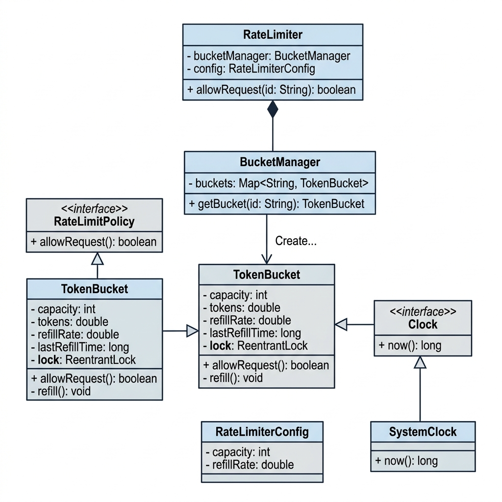

# Rate Limiter - Low Level Design

A Token Bucket based Rate Limiter implemented in Java.

## Problem Statement

Design a rate limiter that controls the number of requests a user can make in a given time window. If a user exceeds the limit, their requests are rejected until tokens are refilled.

## UML Class Diagram



## Design Overview

### Classes

| Class | Responsibility |
|---|---|
| `RateLimiter` | Facade — entry point that takes a userId and returns allow/reject |
| `BucketManager` | Maintains a `Map<String, TokenBucket>` — one bucket per user |
| `TokenBucket` | Core algorithm — holds tokens, refills lazily, consumes on each request |
| `RateLimitPolicy` | Interface so we can swap algorithms (Strategy Pattern) |
| `RateLimiterConfig` | Holds capacity and refillRate |
| `Clock` | Interface to abstract time (makes testing easy) |
| `SystemClock` | Real clock using `System.nanoTime()` |

### Design Patterns Used

- **Strategy Pattern** — `RateLimitPolicy` interface lets us plug in different algorithms
- **Facade Pattern** — `RateLimiter` hides internal complexity from the client
- **Dependency Injection** — `Clock` is injected so we can use a `FakeClock` in tests

## Sequence Diagram

```
Client -> RateLimiter: allowRequest(userId)
RateLimiter -> BucketManager: getBucket(userId)
BucketManager --> RateLimiter: TokenBucket
RateLimiter -> TokenBucket: allowRequest()
TokenBucket -> TokenBucket: lock.lock()
TokenBucket -> TokenBucket: refill()
    alt tokens >= 1
        TokenBucket --> RateLimiter: true (ALLOWED)
    else
        TokenBucket --> RateLimiter: false (REJECTED)
    end
TokenBucket -> TokenBucket: lock.unlock()
RateLimiter --> Client: allow / reject
```

## Component Diagram

```
+-------------+
|   Client    |
+-------------+
       |
       v
+------------------+
|   API Gateway    |
+------------------+
       |
       v
+----------------------+
|  RateLimiter Service |
+----------------------+
       |
       v
+----------------------+
|   Redis / Cache      |
| (tokens + timestamp) |
+----------------------+
```

## Activity Diagram

```
Start
  |
  v
Fetch Bucket for userId
  |
  v
Refill Tokens (lazy)
  |
  v
Tokens >= 1 ?
  |         \
 Yes         No
  |           |
  v           v
Allow      Reject
Request    Request
  |
  v
 End
```

## How to Run

### Compile

```bash
javac -d out src/*.java
```

### Run Demo

```bash
java -cp out ratelimiter.Main
```

### Run Tests

```bash
java -cp out ratelimiter.RateLimiterTest
```

## Expected Output (Demo)

```
=== Rate Limiter Demo ===
Config: RateLimiterConfig{capacity=5, refillRate=1.0}

Sending 8 rapid requests for user-1:
  Request 1 : ALLOWED
  Request 2 : ALLOWED
  Request 3 : ALLOWED
  Request 4 : ALLOWED
  Request 5 : ALLOWED
  Request 6 : REJECTED
  Request 7 : REJECTED
  Request 8 : REJECTED

Waiting 3 seconds for token refill...

Sending 4 more requests for user-1:
  Request 9 : ALLOWED
  Request 10 : ALLOWED
  Request 11 : ALLOWED
  Request 12 : REJECTED

Sending 3 requests for user-2 (separate bucket):
  Request 1 : ALLOWED
  Request 2 : ALLOWED
  Request 3 : ALLOWED

=== Done ===
```

## Project Structure

```
rate limiter/
├── image.png              # UML class diagram
├── README.md
└── src/
    ├── Clock.java
    ├── SystemClock.java
    ├── RateLimitPolicy.java
    ├── RateLimiterConfig.java
    ├── TokenBucket.java
    ├── BucketManager.java
    ├── RateLimiter.java
    ├── Main.java
    └── RateLimiterTest.java
```

## Key Concepts

- **Token Bucket Algorithm** — bucket starts full, each request removes 1 token, tokens refill at a fixed rate over time
- **Lazy Refill** — tokens are calculated on demand instead of using a background timer thread
- **Thread Safety** — `ReentrantLock` inside `TokenBucket` + `ConcurrentHashMap` in `BucketManager`
- **Per-User Buckets** — each userId gets its own independent bucket so one user's traffic doesn't affect another
